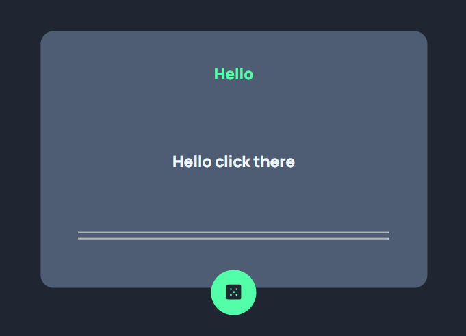
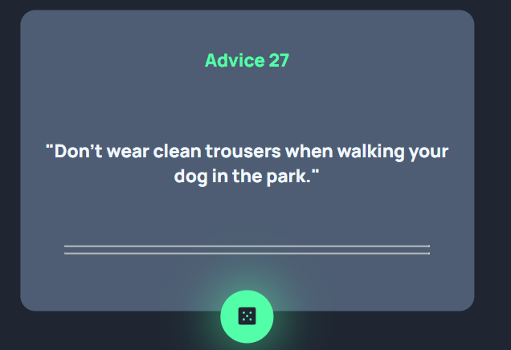
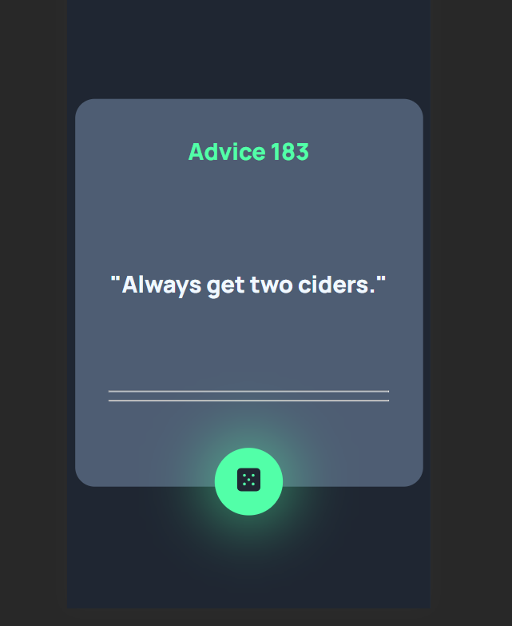

# Frontend Mentor - Advice generator app solution

This is a solution to the [Advice generator app challenge on Frontend Mentor](https://www.frontendmentor.io/challenges/advice-generator-app-QdUG-13db). Frontend Mentor challenges help you improve your coding skills by building realistic projects.


## Table of contents

- [Overview](#overview)
  - [The challenge](#the-challenge)
  - [Screenshot](#screenshot)
  - [Links](#links)
- [My process](#my-process)
  - [Built with](#built-with)
  - [What I learned](#what-i-learned)
- [Author](#author)

## Overview

### The challenge

Users should be able to:

- View the optimal layout for the app depending on their device's screen size
- See hover states for all interactive elements on the page
- Generate a new piece of advice by clicking the dice icon

### Screenshot

](./image.png)
](./image-1.png)
](./image-2.png)

### Links

- API URL: [Advice API](https://api.adviceslip.com/advice)

## My process

### Built with

- Semantic HTML5 markup
- CSS custom properties
- Flexbox
- CSS Grid
- Mobile-first workflow
- JavaScript

### What I learned

How to work with Api's and took id's for using in html

```js
const proudOfThisFunc = () => {
  console.log("
  const getRandomAdvice = () => {
  fetch("https://api.adviceslip.com/advice")
    .then((Response) => Response.json())
    .then((data) => {
      console.log(data);

      const html = document.getElementById("Advice");
      html.innerHTML = `"${data.slip.advice}"`;

      const html2 = document.getElementById("Id");
      html2.innerHTML = `Advice ${data.slip.id}`;
    });
};

const button = document.getElementById("newAdvice");
button.addEventListener("click", getRandomAdvice);

  ");
};
```

